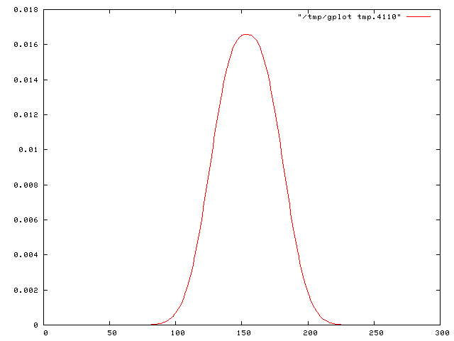
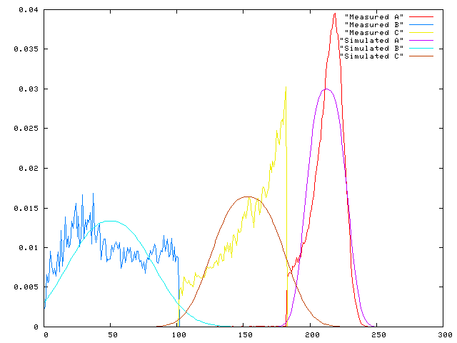

# eplot

eplot ("easy gnuplot") is a ruby script which allows to pipe data easily through gnuplot and create plots quickly, which can be saved in postscript, PDF, PNG or EMF files. Plotting of multiple files into a single diagram is supported. 

## One plot per diagram

The easiest way is to pipe the data through the program. Let's assume that you have a file called data.txt, the syntax would be:

```
cat data.txt | eplot
```

Which will give a result looking like this: 



If the input data is available in a file (as opposed to being the output of another program), then you may as well give its name as an argument to eplot. This works with several data files, which will be opened in seperate windows:

```
eplot file1
eplot file1 file2 file3
```

## Multiple plots in a single diagram

There are several ways to create multiple plots on a single diagramm:

    -m: Several input files: Just give the name of the files on the command line together with the -m option
    -M: A single file, the data for the different curves are in different columns: give the name of the file on the command line or pipe the data through standard in, and set the -M option
    -S: A single file, the data for the different curves are in the same column, but the curves are separated by blank lines: give the name of the file on the command line or pipe the data through standard in, and set the -S option


Examples:

```
eplot -m 'Measured A' 'Measured B' 'Measured C' 'Simulated A' 'Simulated B' 'Simulated C'
eplot -M singlefile.dat
```

Which will give a result looking like this:




## Customize the plot

A couple of options allow to change various settings:

    -r intervals    (e.g. -r [5:10][0:100]) Change the range of the x and the y axis
    -R aspect-ratio     (e.g. -R 0.8)   Change the aspect ratio of the plot
    -s size-factor  (e.g. -s 1.5)   Change the size (resolution) of the plot
    -l curve-type   (e.g. -l points)    Change the type of curve
    -w line-width   (e.g. -w 2) Change the line width (default: 1)
    -t title    (e.g. -t 'Error Rate@Recall@Precision') Change the title(s) of the curve(s) (separated by @)
    -x x-options    (e.g. -x 'sigma')   Change options of the x-axis, e.g. the label but also other options.
    -y y-options    (e.g. -y 'error rate')) Change options of the y-axis, e.g. the label but also other options.
    -B pos,height   (e.g. -B 100,0.1)   Add a vertical bar at position pos with height height. Several bars may be added, separated by @

For example, creating a plot of three curves (three types of classification accuracy measures in this case) which are stored as three different columns in the file data.txt, with a custmozed x-axis label and customized plot titles as well as a manual setting of the x and y range, can be done with this command:

```
cat data.txt | eplot -M -x 'number of neighbors' -r [1:20][0:1] -t 'Accuracy@Precision@Recall'
```

## Saving into external files

Various options allow to save a plot into diffrent formats. The filename cannot be specified, it is fixed to "foo.XXX", XXX being the extention of the respective file format:

    -P Save into a PNG image (foo.png)
    -p Save into a postscript image (foo.ps)
    -a Save into a PDF image (foo.pdf)
    -e Save into a EMF image (foo.emf)

## Selecting rows

In some situations you might want to plot data from a file but ignore part of the file contents. If the file is organized in columns, i.e. you will plot it using the -M option to eplot, then the selection of a subset of the file's columns can be done using the ec tool (say "extract column"). Just add it as a filter between the data and the eplot command. For instance, if you want to plot columns 2 and 3 only:

```
cat data.txt | ec 2 3 | eplot -M
```

ec is also usefull if the columns in the original file are not separated by whitespace but by another character. The character separater used by ec can configured by adding it on the command line preceeded by a dash. The output character separater is always whitespace, as requested by eplot. If, for example, you have a file whose columns are seperated by a semicolon and you want to plot columns 5 and 3, use the command:

```
cat data.txt | ec -; 5 3 | eplot -M
```

## Installation 

No setup is necessary. Just download the script files (eplot and ec) and put them into a directory which is in the PATH of your shell. Just be sure that the ruby shell is available as /usr/bin/ruby, else create a link or change the first line of each script. 

The standard configuration of the script only works with gnuplot 4.0 or newer, the reason being a couple of changes in the gnuplot syntax. However, the script may be adapted to older versions by a unique and simple change: set the variable "$GnuPlot4OrNewer" at the beginning of the script (in the configuration section) to "false": 

```
$GnuPlot4OrNewer=false
```

##### Gnuplot

eplot is based on Gnuplot and needs Gnuplot 4.0 or newer. Older versions are supported but a variable must be changed in the eplot script (see the download section)

##### Ruby

eplot and ec are completely written in the ruby programming language, so you need to have the ruby runtime package installed. Ruby comes with most Linux distributions. 

## Credits

eplot was written by [Christian Wolf](http://liris.cnrs.fr/christian.wolf).
The dumb terminal patch was provided by Peter Barnes.

## Licence

This program is free software; you can redistribute it and/or modify it under the terms of the GNU General Public License as published by the Free Software Foundation; either version 2 of the License, or (at your option) any later version.

This program is distributed in the hope that it will be useful, but WITHOUT ANY WARRANTY; without even the implied warranty of MERCHANTABILITY or FITNESS FOR A PARTICULAR PURPOSE. See the GNU General Public License for more details.

You should have received a copy of the GNU General Public License along with this program; if not, write to the Free Software Foundation, Inc., 59 Temple Place - Suite 330, Boston, MA 02111-1307, USA. 


